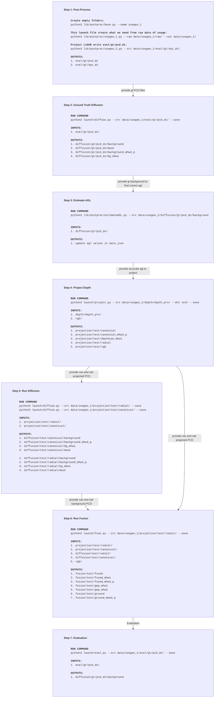

```mermaid
flowchart TD

    A[<div style='width: 900px; text-align:left';>
        <b>Step 1: Post Process</b>
        <pre>
        <b>Create empty folders:</b>
        python3 lib/postproc/base.py --name usegeo_1

        <b>This launch file create what we need from raw data of usege:</b>
        python3 lib/postproc/usegeo_1.py --raw data/usegeo_1/raw/ --out data/usegeo_1/
        
        <b>Project LiDAR write eval/gt/pcd_ds:</b>
        python3 lib/postproc/usegeo_2.py --src data/usegeo_1/eval/gt/npz_ds/
        
        <b>OUTPUTS:</b>
        1. eval/gt/pcd_ds
        2. eval/gt/npz_ds
        </pre>
      </div>]
    
    B[<div style='width: 900px; text-align:left';>
        <b>Step 2: Ground Truth Diffusion</b>
        <pre>
        <b>RUN COMMAND</b>
        python3 launch/diffuse.py --src data/usegeo_1/eval/gt/pcd_ds/ --save

        <b>INPUTS:</b>
        1. eval/gt/pcd_ds/

        <b>OUTPUTS:</b>
        1. diffusion/gt/pcd_ds/background
        2. diffusion/gt/pcd_ds/mask
        3. diffusion/gt/pcd_ds/background_mhw3_p
        4. diffusion/gt/pcd_ds/bg_mhw1 
        </pre>
      </div>]
    
    C[<div style='width: 900px; text-align:left';>
        <b>Step 3: Estimate AGL</b>
        <pre>
        <b>RUN COMMAND</b>
        python3 lib/postproc/estimateAGL.py --src data/usegeo_1/diffusion/gt/pcd_ds/background/


        <b>INPUTS:</b>
        1. diffusion/gt/pcd_ds/

        <b>OUTPUTS:</b>
        1. update agl values in data.json
        </pre>
      </div>]
    
    D[<div style='width: 900px; text-align:left';>
        <b>Step 4: Project Depth</b>
        <pre>
        <b>RUN COMMAND</b>
        python3 launch/project.py --src data/usegeo_1/depth/depth_pro/ --dst test --save

        <b>INPUTS:</b>
        1. depth/depth_pro/
        2. rgb/

        <b>OUTPUTS:</b>
        1. projection/test/canonical
        2. projection/test/canonical_mhw3_p
        3. projection/test/depthcan_mhw1
        4. projection/test/radial
        5. projection/test/rgb
        </pre>
      </div>]
    
    E[<div style='width: 900px; text-align:left';>
        <b>Step 5: Run Diffusion</b>
        <pre>
        <b>RUN COMMAND</b>
        python3 launch/diffuse.py --src data/usegeo_1/projection/test/radial/ --save
        python3 launch/diffuse.py --src data/usegeo_1/projection/test/canonical/ --save

        <b>INPUTS:</b>
        1. projection/test/radial/
        2. projection/test/canonical/

        <b>OUTPUTS:</b>
        1. diffusion/test/canonical/background
        2. diffusion/test/canonical/background_mhw3_p
        3. diffusion/test/canonical/bg_mhw1
        4. diffusion/test/canonical/mask

        1. diffusion/test/radial/background
        2. diffusion/test/radial/background_mhw3_p
        3. diffusion/test/radial/bg_mhw1
        4. diffusion/test/radial/mask

        </pre>
      </div>]
    
    F[<div style='width: 900px; text-align:left';>
        <b>Step 6: Run Fusion</b>
        <pre>
        <b>RUN COMMAND</b>
        python3 launch/fuse.py --src data/usegeo_1/projection/test/radial/ --save

        <b>INPUTS:</b>
        1. projection/test/radial/
        2. projection/test/canonical/
        3. diffusion/test/radial/
        4. diffusion/test/canonical/
        5. rgb/

        <b>OUTPUTS:</b>
        1. fusion/test/fused
        2. fusion/test/fused_mhw1
        3. fusion/test/fused_mhw3_p
        4. fusion/test/gep_mhw1
        5. fusion/test/gep_mhw3
        6. fusion/test/ground
        7. fusion/test/ground_mhw3_p
        </pre>
      </div>]
    
    G[<div style='width: 900px; text-align:left';>
        <b>Step 7: Evaluation</b>
        <pre>
        <b>RUN COMMAND</b>
        python3 launch/eval.py --src data/usegeo_1/eval/gt/pcd_ds/ --save

        <b>INPUTS:</b>
        1. eval/gt/pcd_ds/

        <b>OUTPUTS:</b>
        1. diffusion/gt/pcd_ds/background
        </pre>
      </div>]
    

    %% A = post process
    %% B = gt diffusion
    %% C = estimate agl
    %% D = projection
    %% E = diffusion
    %% F = fusion
    %% G = evaluation


    A -->|provide gt PCD files| B
    B -->|provide gt background to find correct agl| C
    C -->|provide accurate agl to project| D
    D -->|provide can and rad projected PCD| E
    E -->|provide can and rad background PCD| F
    D -->|provide can and rad projected PCD| F
    F -->|Evaluation| G
```